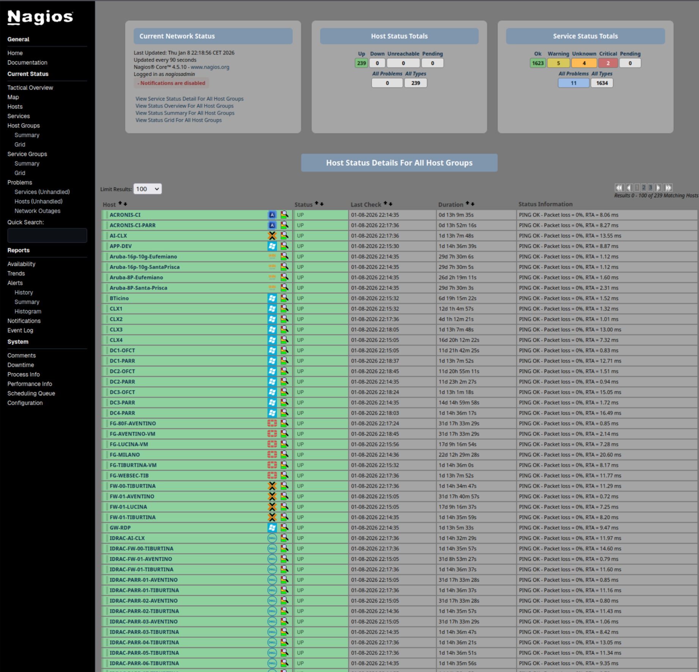

# Nagios Core – Modern UI Tweaks
A minimal, CSS-only modernization of the Nagios Core web interface.

No JavaScript.  
No themes engine.  
No layout changes.

Just cleaner colors, modern fonts and better readability — while keeping the original Nagios look & feel.

## ✨ Features
- Modern neutral gray background
- Softer, readable OK / WARNING / CRITICAL colors
- System UI font stack (Segoe UI / Roboto / Ubuntu)
- Host names emphasized, services unchanged
- Consistent look across:
  - avail.cgi
  - status.cgi
  - extinfo.cgi
  - cmd.cgi

## 📸 Screenshots
| Status Overview | Host Detail |
|-----------------|------------|
|  |  |

## 🛠 Installation
Replace the following files in your Nagios Core installation:

- /usr/local/nagios/share/stylesheets/avail.css
- /usr/local/nagios/share/stylesheets/cmd.css
- /usr/local/nagios/share/stylesheets/extinfo.css
- /usr/local/nagios/share/stylesheets/history.css
- /usr/local/nagios/share/stylesheets/outage.css
- /usr/local/nagios/share/stylesheets/status.css
- /usr/local/nagios/share/stylesheets/tac.css

Restart is **not required**.  
Just hard-refresh your browser (Ctrl+F5).

## ⚠️ Notes
- Tested on **Nagios Core 4.5.x**
- This project modifies only CSS files
- Fully reversible by restoring original stylesheets

## ❤️ Credits
Original UI: Nagios Core  
Modifications: community-driven

PRs welcome.
