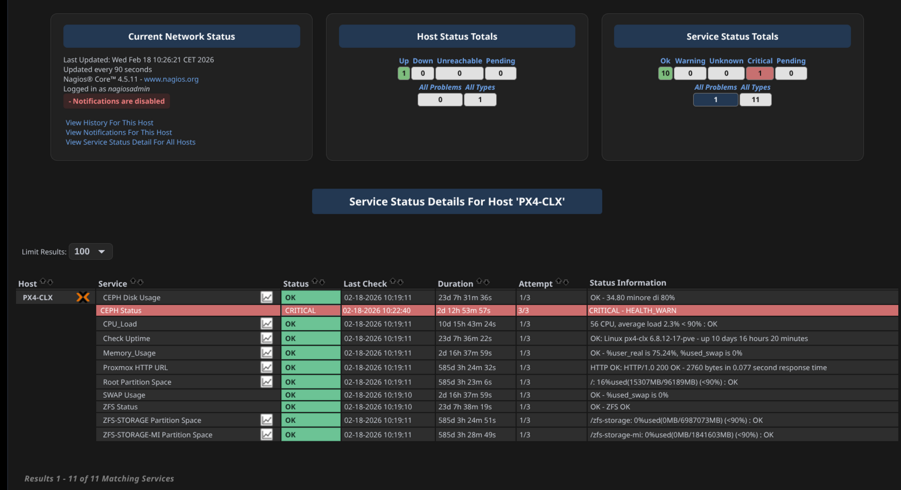
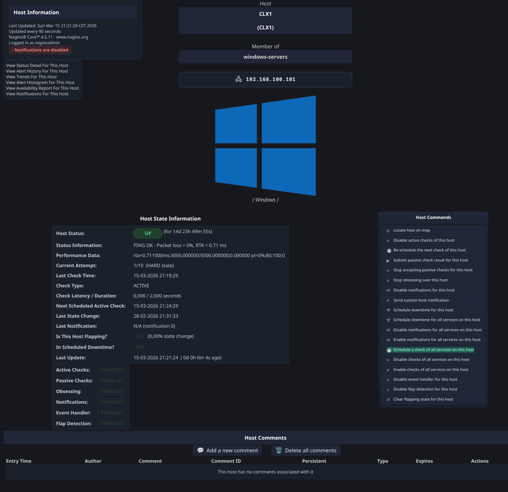
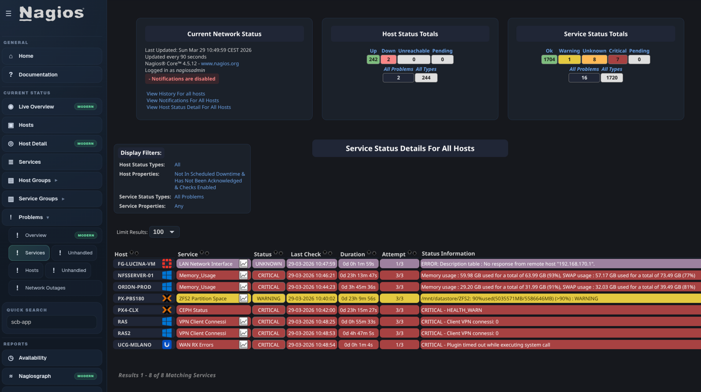

# Nagios Core – Modern UI Tweaks
A minimal, CSS-only modernization of the Nagios Core web interface.

No JavaScript.  
No themes engine.  
No layout changes.

Just cleaner colors, modern fonts and better readability — while keeping the original Nagios look & feel.


## ✨ Features

- Modern neutral dark background
- Softer, more readable OK / WARNING / CRITICAL colors
- Improved contrast for status counters
- System UI font stack (Segoe UI / Roboto / Ubuntu / San Francisco)
- Host names emphasized, services unchanged
- Cleaner status summary layout
- Better readability for Unhandled / Problem indicators
- Fully dark-mode optimized

Consistent styling across:

- `avail.cgi`
- `status.cgi`
- `extinfo.cgi`
- `cmd.cgi`
- `tac.cgi`
- `summary.cgi`
- and all standard Nagios Core pages


## 🎨 New Icon Set

In addition to the CSS modernization, this project introduces a **new modern SVG icon set**.

Redesigned icons include:

- 💬 Comments
- ⚙ Actions
- 📊 Status (alternative icon)
- 🔁 Flapping

### Design Goals

- Flat, minimal SVG style  
- Crisp rendering at 16–20px  
- Consistent stroke weight  
- Dark-mode friendly contrast  
- Lightweight and scalable  

Icons replace the original bitmap-style images while preserving:

- Original behavior  
- Original layout  
- Original functionality  

No backend modifications required.


## 📸 Screenshots
| Status Overview | Host Detail |
|-----------------|------------|
|  |  |

| Extended Info | Service Problems |
|-----------------|------------|
|  |  |


## 🛠 Installation

Replace the following files in your Nagios Core installation:

```
[nagios_root_path]/share/stylesheets/avail.css
[nagios_root_path]/share/stylesheets/cmd.css
[nagios_root_path]/share/stylesheets/config.css
[nagios_root_path]/share/stylesheets/extinfo.css
[nagios_root_path]/share/stylesheets/histogram.css
[nagios_root_path]/share/stylesheets/history.css
[nagios_root_path]/share/stylesheets/notifications.css
[nagios_root_path]/share/stylesheets/outages.css
[nagios_root_path]/share/stylesheets/showlog.css
[nagios_root_path]/share/stylesheets/status.css
[nagios_root_path]/share/stylesheets/summary.css
[nagios_root_path]/share/stylesheets/tac.css
[nagios_root_path]/share/stylesheets/trends.css
```

For the new icons, replace:
```
[nagios_root_path]/share/images/comments.svg
[nagios_root_path]/share/images/action.svg
[nagios_root_path]/share/images/status2.svg
[nagios_root_path]/share/images/flapping.svg
```


Restart is **not required**.  
Just hard-refresh your browser (Ctrl+F5).

You can also download stylesheets.zip with all CSS files included 
and images.zip with all new icons

## ⚠️ Notes
- Tested on Nagios Core 4.5.x
- Modifies only CSS and image files
- No PHP changes
- No configuration changes
- Fully reversible by restoring original stylesheets and images


## ❤️ Credits
Original UI: Nagios Core  
Modifications: community-driven

PRs welcome.
