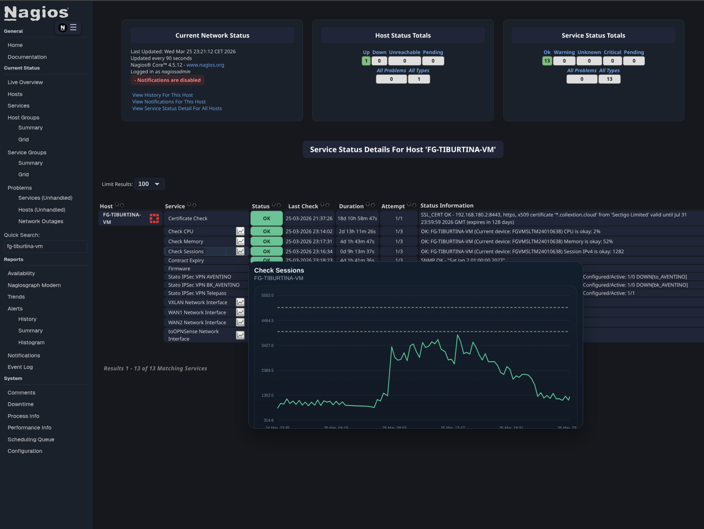

# Nagios Core – Modern UI Tweaks
A modern, responsive redesign of the Nagios Core web interface, including refreshed PHP pages and a modern standalone graph layer.

No theme engine.

Cleaner colors, modern fonts, better readability, responsive layout, custom live overview pages, and modern graph rendering — while keeping the original Nagios look & feel.


## ✨ Features

- **Dark Blue theme** — deep navy palette for a modern, professional look
- Rounded corners on tables, badges and info boxes
- Softer, more readable OK / WARNING / CRITICAL colors
- Improved contrast for status counters
- System UI font stack (Segoe UI / Roboto / Ubuntu / San Francisco)
- Host names emphasized, services unchanged
- Cleaner status summary layout
- Better readability for Unhandled / Problem indicators
- Fully dark-mode optimized
- **Responsive layout** — works on desktop, tablet and mobile screens
- **Rewritten sidebar** (`side.php`) — clean PHP navigation with theme support
- **Live Overview dashboard** (`live.php`) — custom tactical overview powered by `status.dat`
- **Historical trend snapshots** (`live_trend_snapshot.php`) — lightweight PHP collector for the Live Overview dashboard
- **Nagiosgraph Modern** (`nagiosgraph_modern/`) — standalone PHP + JS frontend that reads the same RRD files used by Nagiosgraph and renders modern graphs

Consistent styling across:

- `avail.cgi`
- `status.cgi`
- `extinfo.cgi`
- `cmd.cgi`
- `tac.cgi`
- `summary.cgi`
- and all standard Nagios Core pages


## 📱 Responsive Layout

Starting from version 0.2.0, the UI is fully responsive.

To achieve this, a modification to `index.php` was necessary in addition to the CSS changes. The original fixed-width frameset layout has been replaced with a fluid structure that adapts to different screen sizes and orientations.

Key changes introduced in `index.php`:

- **Hamburger button** — a toggle button (☰) is always visible, on both desktop and mobile. It shows the Nagios logo and collapses/expands the sidebar with a smooth CSS transition.
- **Desktop behavior** — clicking the hamburger collapses the sidebar and expands the main content area to full width.
- **Mobile behavior** — on screens ≤ 768px, the sidebar slides in as an overlay with a semi-transparent backdrop, leaving the main content always full width underneath.
- **Auto-scaling** — on narrow screens, a JavaScript zoom is applied to the main iframe content to compensate for Nagios CGI pages having a fixed native width (~1024px).

This means the project now includes **CSS, PHP and JavaScript changes**.


## 🎨 New Icon Set

In addition to the CSS modernization, this project introduces a **new modern SVG icon set**.

Redesigned icons include:

- 💬 Comments
- ⚙ Actions
- 📊 Status (alternative icon)
- 🔁 Flapping


## 🖼️ Service Logos
A set of service logos has been added.

- Clean PNG icons, optimized for dark mode

- Consistent sizing and lightweight

- Transparent background where applicable

📁 Location

[nagios_root_path]/share/images/logos/

Example:

[nagios_root_path]/share/images/logos/debian.png
[nagios_root_path]/share/images/logos/proxmox.png
[nagios_root_path]/share/images/logos/opnsense.png
[nagios_root_path]/share/images/logos/fortinet.png

These logos enhance visual scanning without changing Nagios behavior or performance.

### Design Goals

- Flat, minimal SVG style  
- Crisp rendering at 16–20px  
- Consistent stroke weight  
- Dark-mode friendly contrast  
- Lightweight and scalable  

Icons replace the original bitmap-style images while preserving:

- Original behavior  
- Original layout  
- Original functionality  


## 📸 Screenshots
| Status Overview | Host Detail |
|-----------------|------------|
|  |  |

| Live Overview | Service Problems |
|-----------------|------------|
|  |  |


## 🛠 Installation

Replace the following files in your Nagios Core installation:

```
[nagios_root_path]/share/index.php
[nagios_root_path]/share/live.php
[nagios_root_path]/share/live_trend_snapshot.php
[nagios_root_path]/share/nagios.png
[nagios_root_path]/share/side.php
[nagios_root_path]/share/nagiosgraph_modern/data.php
[nagios_root_path]/share/nagiosgraph_modern/popup.js
[nagios_root_path]/share/nagiosgraph_modern/show.php

[nagios_root_path]/share/stylesheets/avail.css
[nagios_root_path]/share/stylesheets/cmd.css
[nagios_root_path]/share/stylesheets/config.css
[nagios_root_path]/share/stylesheets/extinfo.css
[nagios_root_path]/share/stylesheets/histogram.css
[nagios_root_path]/share/stylesheets/history.css
[nagios_root_path]/share/stylesheets/notifications.css
[nagios_root_path]/share/stylesheets/outages.css
[nagios_root_path]/share/stylesheets/showlog.css
[nagios_root_path]/share/stylesheets/status.css
[nagios_root_path]/share/stylesheets/summary.css
[nagios_root_path]/share/stylesheets/tac.css
[nagios_root_path]/share/stylesheets/trends.css
[nagios_root_path]/share/images/logos/*
```

For the new icons, replace:
```
[nagios_root_path]/share/images/comments.svg
[nagios_root_path]/share/images/action.svg
[nagios_root_path]/share/images/status2.svg
[nagios_root_path]/share/images/flapping.svg
```

If you want the historical trend in `live.php`, add this cron job:

```cron
*/5 * * * * root /usr/bin/php 
[nagios_root_path]/share/live_trend_snapshot.php >/dev/null 2>&1
```

This populates the JSON snapshot file used by the Live Overview availability trend.

If you want to enable the new graph page and hover preview for graphed services, update your `graphed-service` template action URL:

```cfg
define service {
       name graphed-service
       action_url /nagios/nagiosgraph_modern/show.php?host=$HOSTNAME$&service=$SERVICEDESC$' target='main' onClick='parent.hideModernGraphPopup()' onMouseOver='parent.showModernGraphPopup(this,event)' onMouseMove='parent.moveModernGraphPopup(event,this)' onMouseOut='parent.hideModernGraphPopup()' rel='/nagios/nagiosgraph_modern/show.php?host=$HOSTNAME$&service=$SERVICEDESC$&range=24h&embed=1
       register 0
       notification_interval 1440
}
```

To support the hover preview, make sure `index.php` loads:

```html
<script src="nagiosgraph_modern/popup.js"></script>
```

Restart is **not required**.  
Just hard-refresh your browser (Ctrl+F5).

You can package the whole `share/` tree as `share.zip` for deployment.


## ⚠️ Notes
- Tested on Nagios Core 4.5.x
- Modifies CSS files, image files, PHP files and JavaScript files
- Includes optional Nagios configuration changes for `action_url`
- Includes optional cron configuration for historical snapshots
- Fully reversible by restoring original files


## ❤️ Credits
Original UI: Nagios Core  
Modifications: community-driven

PRs welcome.
