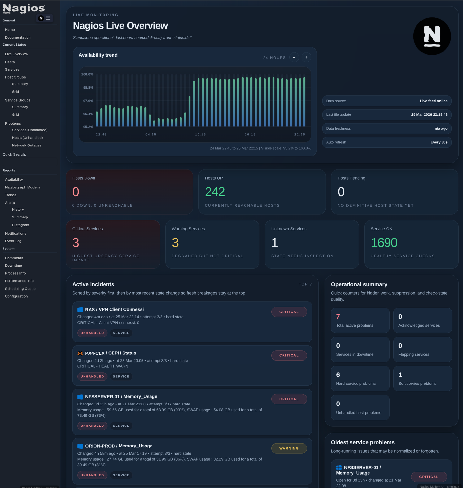
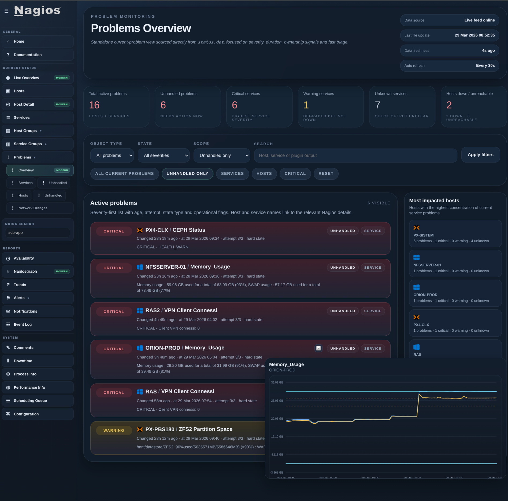
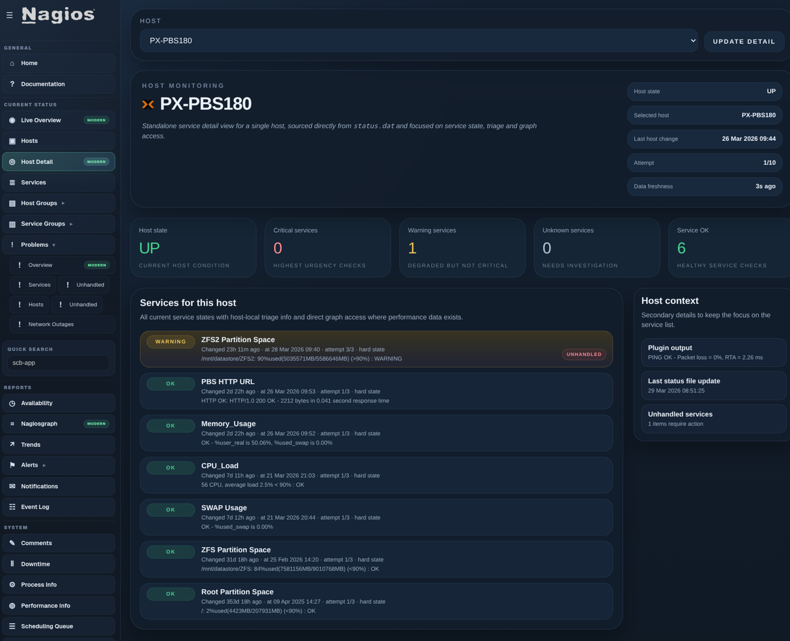
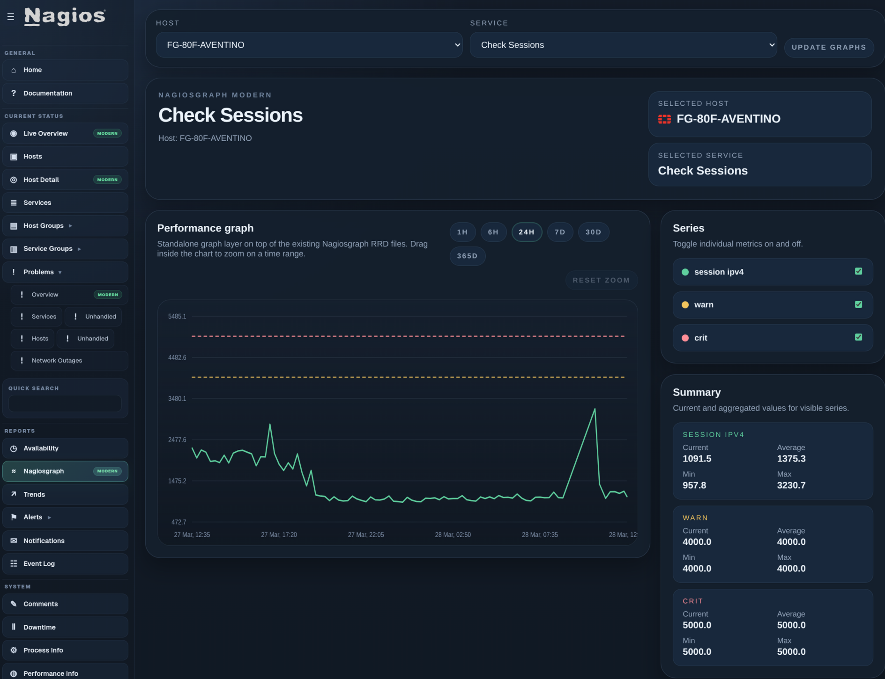
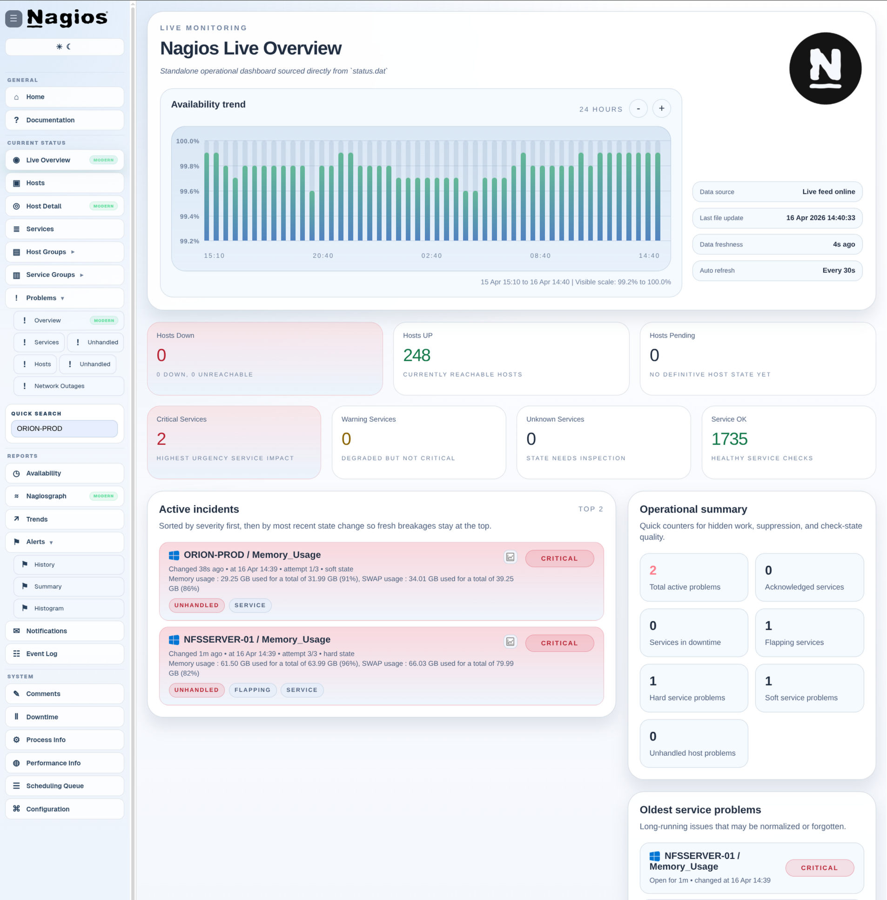
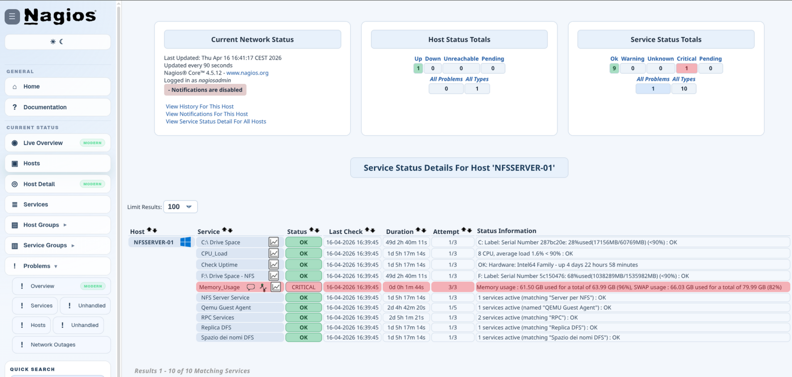
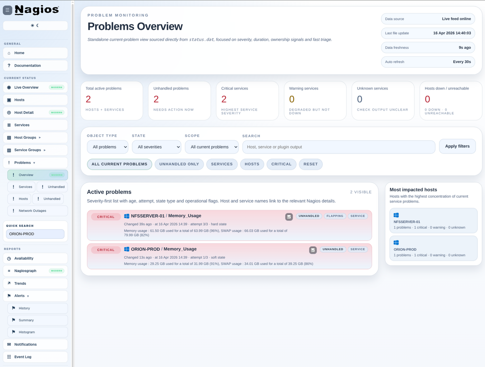
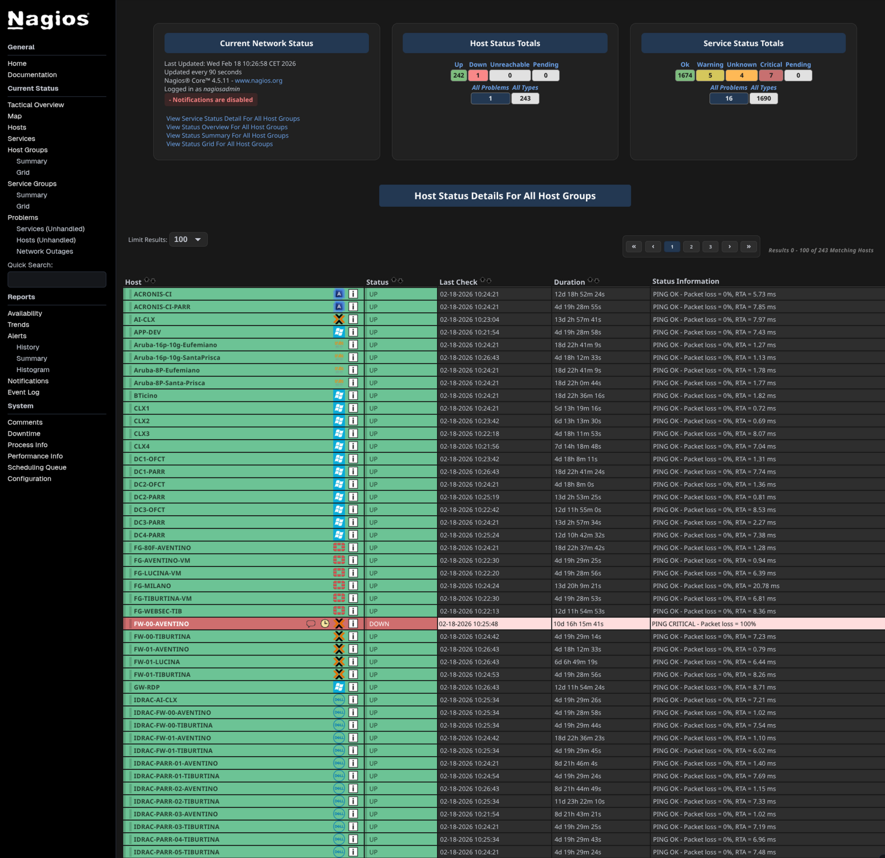
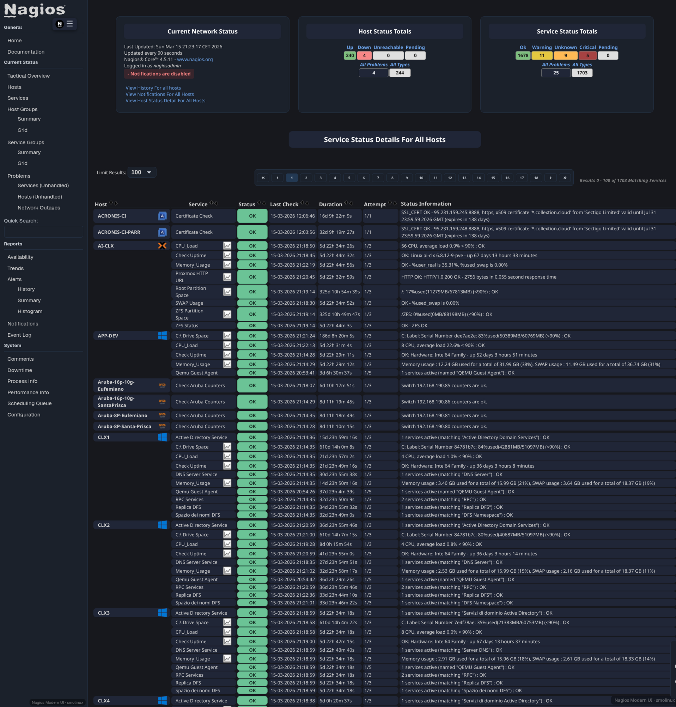

# Nagios Core Modern UI
A modern Nagios Core frontend refresh built with CSS, PHP and light JavaScript.

This project keeps the original Nagios CGI backend intact while adding standalone modern pages, a redesigned sidebar shell, a custom live dashboard and a modern graph layer backed by the same Nagiosgraph RRD files.

## Features

- Dark blue UI refresh across the standard Nagios Core pages
- Global dark/light theme switch with persisted preference
- Responsive `index.php` shell and a modernized `side.php`
- Compact/expanded sidebar navigation with active page highlighting
- `live.php` modern live overview sourced directly from `status.dat`
- `problems.php` modern problems view with severity-first triage
- `host_detail.php` modern host service detail view
- `hostgroups.php` modern host group overview
- `hostgroups_summary.php` modern host group summary
- `nagiosgraph_modern/` modern graph frontend for existing Nagiosgraph RRD data
- Host logo support via `hostextinfo.cfg`
- Historical availability snapshots via `live_trend_snapshot.php`
- Hover graph preview for graphed services through `popup.js`
- Light-theme coverage extended to modern pages and classic CGI pages (`status`, `avail`, `trends`, `history`, `summary`, `histogram`, `notifications`, `showlog`, `extinfo`, `config`, `cmd`)

## Included Modern Pages

- `live.php`
- `problems.php`
- `host_detail.php`
- `hostgroups.php`
- `hostgroups_summary.php`
- `nagiosgraph_modern/show.php`

These pages are standalone and reversible. They do not modify Nagios CGI binaries.

## Responsive Shell

Starting from the responsive shell work and expanded further in `0.5.0`, the project includes:

- a custom `index.php`
- a modern `side.php`
- JavaScript for active-nav syncing, theme persistence/sync and graph popup preview

Desktop and mobile are both supported:

- Desktop: collapsible left sidebar with compact and expanded modes
- Mobile: overlay sidebar with backdrop
- Narrow layouts: iframe scaling for old fixed-width Nagios CGI pages

## Screenshots

| Live Overview | Problems Overview |
|---|---|
|  |  |

| Host Detail | Nagiosgraph |
|---|---|
|  |  |

| Light Live Overview | Light Host Detail |
|---|---|
|  |  |

| Light Problems Overview |  |
|---|---|
|  |  |

| Classic Status Restyle | Classic Service Status Restyle |
|---|---|
|  |  |

## Installation

Replace the relevant files in your Nagios Core installation.

Core shell and modern pages:

```text
[nagios_root_path]/share/index.php
[nagios_root_path]/share/side.php
[nagios_root_path]/share/live.php
[nagios_root_path]/share/live_trend_snapshot.php
[nagios_root_path]/share/problems.php
[nagios_root_path]/share/host_detail.php
[nagios_root_path]/share/hostgroups.php
[nagios_root_path]/share/hostgroups_summary.php
[nagios_root_path]/share/nagios.png
[nagios_root_path]/share/stylesheets/theme.js
```

Nagiosgraph Modern:

```text
[nagios_root_path]/share/nagiosgraph_modern/data.php
[nagios_root_path]/share/nagiosgraph_modern/popup.js
[nagios_root_path]/share/nagiosgraph_modern/show.php
```

Stylesheets:

```text
[nagios_root_path]/share/stylesheets/avail.css
[nagios_root_path]/share/stylesheets/cmd.css
[nagios_root_path]/share/stylesheets/config.css
[nagios_root_path]/share/stylesheets/extinfo.css
[nagios_root_path]/share/stylesheets/histogram.css
[nagios_root_path]/share/stylesheets/history.css
[nagios_root_path]/share/stylesheets/notifications.css
[nagios_root_path]/share/stylesheets/outages.css
[nagios_root_path]/share/stylesheets/showlog.css
[nagios_root_path]/share/stylesheets/status.css
[nagios_root_path]/share/stylesheets/summary.css
[nagios_root_path]/share/stylesheets/tac.css
[nagios_root_path]/share/stylesheets/trends.css
```

Icons and logos:

```text
[nagios_root_path]/share/images/comments.svg
[nagios_root_path]/share/images/action.svg
[nagios_root_path]/share/images/status2.svg
[nagios_root_path]/share/images/flapping.svg
[nagios_root_path]/share/images/logos/*
```

## Live Overview Historical Trend

If you want the historical availability trend in `live.php`, add this cron job:

```cron
*/5 * * * * root /usr/bin/php /usr/local/nagios/share/live_trend_snapshot.php >/dev/null 2>&1
```

This populates the JSON snapshot data used by the live availability widget.

## Nagiosgraph Modern Integration

If you want graphed services to use the new graph page and hover preview, update your `graphed-service` template:

```cfg
define service {
       name graphed-service
       action_url /nagios/nagiosgraph_modern/show.php?host=$HOSTNAME$&service=$SERVICEDESC$' target='main' onClick='parent.hideModernGraphPopup()' onMouseOver='parent.showModernGraphPopup(this,event)' onMouseMove='parent.moveModernGraphPopup(event,this)' onMouseOut='parent.hideModernGraphPopup()' rel='/nagios/nagiosgraph_modern/show.php?host=$HOSTNAME$&service=$SERVICEDESC$&range=24h&embed=1
       register 0
       notification_interval 1440
}
```

Make sure `index.php` loads:

```html
<script src="nagiosgraph_modern/popup.js"></script>
```

## Notes

- Tested on Nagios Core `4.5.x`
- Modifies CSS, images, PHP and JavaScript
- Theme preference is persisted in browser storage (`localStorage`)
- Includes optional Nagios configuration changes for `action_url`
- Includes optional cron configuration for live trend history
- Fully reversible by restoring the original files

## Credits

Original UI: Nagios Core  
Modernization and standalone pages: community-driven

PRs welcome.
